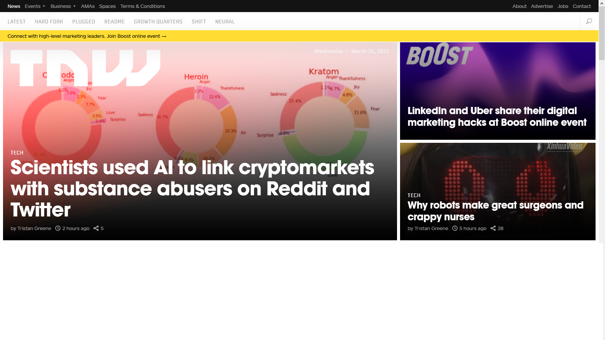

# Project Name

> Project 2: Building with Responsive Design - TNW Clone.

This project is about cloning [this](https://thenextweb.com/) TNW web page by using RWD concept.

## Built With

- HTML5  
- CSS

## Live Demo

[Live Demo Link](https://alexjustalex2020.github.io/TNW-project-2/)

## Getting Started

**To get a local copy up and running follow these simple steps.**

### Prerequisites

-Web browser

### Setup

-Download/Clone the repository files and navigate to index.html.

### Install

-No installation required

### Deployment

-You can deploy this project by cloning it then:

- Goto the repository's settings.
- Navigate to GitHub Pages section.
- Select the appropriate branch.
- Submit your changes.

## Authors

👤 **Author1**

- GitHub: [@omar-labana](https://github.com/omar-labana)
- Twitter: [@panda4cs](https://twitter.com/Panda4cs)
- LinkedIn: [OmarLabana](https://www.linkedin.com/in/omarlabana/)

👤 **Author2**

- GitHub: [@AlexJustAlex2020 ](https://github.com/AlexJustAlex2020/)
- Twitter: [@Alexand81099721 ](https://twitter.com/Alexand81099721)
- LinkedIn: [AlexanderMorales](https://www.linkedin.com/in/alexander-morales-b8539898/)

## 🤝 Contributing

Contributions, issues, and feature requests are welcome!

Feel free to check the [issues page](../../issues/).

## Show your support

Give a ⭐️ if you like this project!

## Acknowledgments

- [Microverse](https://www.microverse.org/)
- [TNW](https://thenextweb.com/)
- [The Odin Project](https://www.theodinproject.com)

## 📝 License

This project is [MIT](./MIT.md) licensed.
